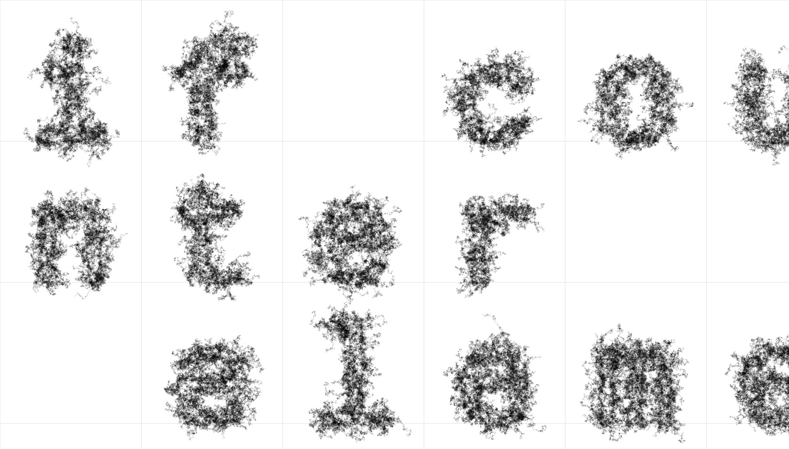
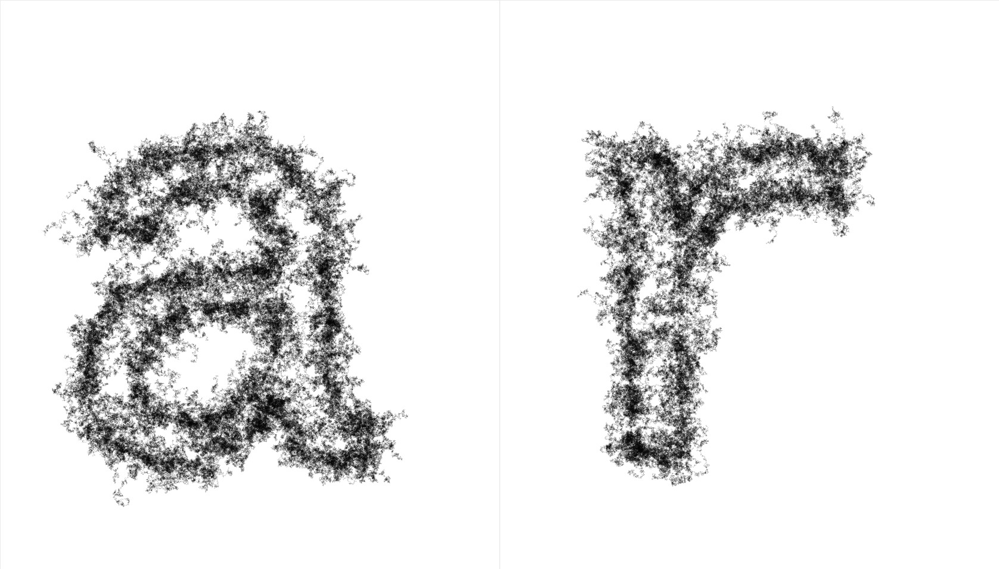

# glyphGrid

I'm using the [p5.js](https://p5js.org/) javascript library to create an animation in the webbrowser. My program renders "glyph objects" in a responsive grid, based on your input and screen. For this design I used [Cousine](https://fonts.google.com/specimen/Cousine?selection.family=Cousine) a beautiful sans serif by Steve Matteson. Font size and grid depend on the number of letters entered. Each single letter is resolved into an object with a variety of moving points. These individual dots are animated in each frame of the animation and draw delicate patterns on the canvas, that can be saved and shared.

https://matthias-jaeger-net.github.io/glyphgrid/

# Much to do ...
- [x] Create running example page
- [x] Better math for grid.js
- [ ] Make even better math than that?
- [ ] Modal screen
- [ ] Add "save image" button
- [ ] Pass all the different google fonts as a pulldown
