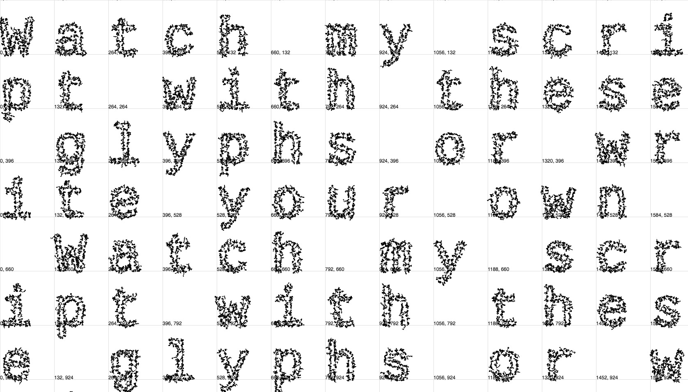
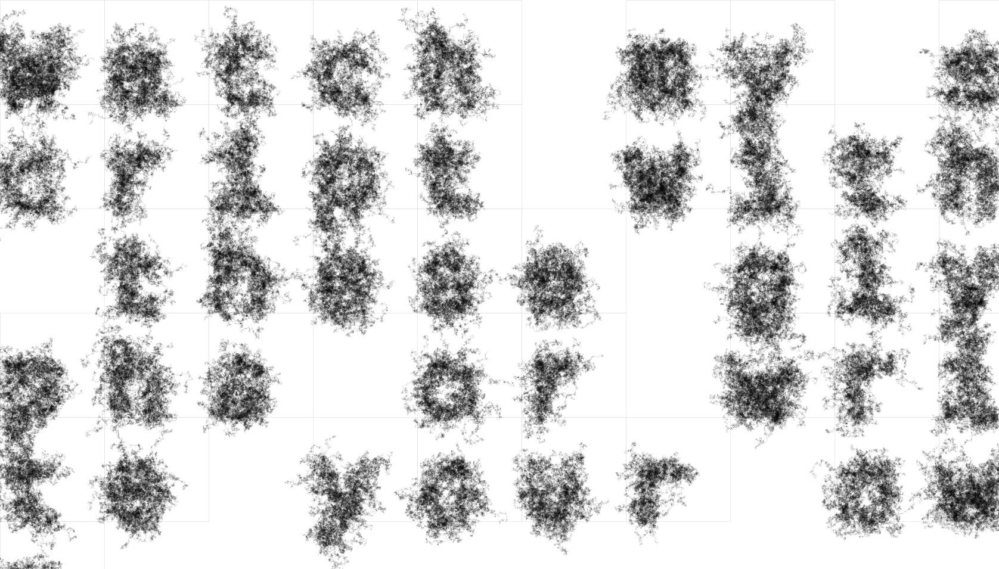

I'm using the [p5.js](https://p5js.org/) javascript library to create an animation in the webbrowser. My program renders "glyph objects" in a responsive grid, based on your input and screen. For this design I used [Cousine](https://fonts.google.com/specimen/Cousine?selection.family=Cousine) a beautiful sans serif by Steve Matteson. Font size and grid depend on the number of letters entered. Each single letter is resolved into an object with a variety of moving points. These individual dots are animated in each frame of the animation and draw delicate patterns on the canvas, that can be saved and shared.

https://matthias-jaeger-net.github.io/glyphgrid/

## File structure 
  - index.html
  - app.js / Setup and draw loop 
  - / scripts       
    - glyph.js / Constructor function "glyph object"
    - grid.js / Creating a responsive grid based on user input
    - interface.js / User Event listeners and actions
  - / libraries
    - p5.js
    - p5.dom.js
    - p5.sound.js       Not needed yet
  - / css              
    - style.css

# To do
- [x] Create running example page
- [x] Better math for grid.js
- [ ] Make even better math than that?
- [ ] Style modal screen
- [ ] Add "save image" button
- [ ] Add speech recognition functions to input
- [ ] Pass all the different google fonts as a pulldown
